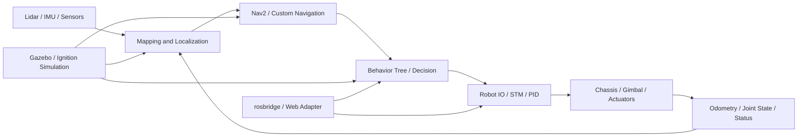

# rm_2026

ROS 2 Humble workspace for the RM / RMU 2026 robot stack.

This repository contains the integrated workspace used for:
- autonomous navigation and mapping
- behavior-tree-based decision making
- robot IO and serial communication
- simulation and robot description
- rosbridge / web integration

## Overview

`rm_2026` is organized as one top-level `colcon` workspace, with domain packages grouped under `src/`:
- `src/navigation`: localization, planning, lidar mapping, navigation plugins, bringup
- `src/decision`: behavior tree runtime, decision interfaces, sentry decision logic
- `src/robot_io`: chassis odometry, gimbal state, PID control, STM serial bridge
- `src/simulation`: Gazebo / Ignition plugins, robot description, simulation worlds
- `src/integration`: serial library, rosbridge suite and integration utilities
- `src/interfaces`: custom messages and shared interfaces

## Architecture



## Package Layout

### Navigation
- `pb2025_sentry_nav`: navigation meta-repository with bringup, lidar, plugins and support packages
- `ego_planner_ros2`: local planner package
- `far_planner_ros2`: far-range planner package
- `pointcloud2_deal`: point cloud processing utilities
- `nav2_msgs`, `nav2_common`: nav2 support packages used locally in the workspace

### Decision
- `navigate_tree`: behavior-tree-based navigation runtime
- `rm_sentry_decision`: sentry decision logic
- `rm_decision_interfaces`: decision-related message and service interfaces
- `behaviortree_cpp_v3`: local BT runtime dependency

### Robot IO
- `ros2_stm`: serial communication with STM controller
- `chassis_odom`: chassis odometry and navigation target interface
- `gimbal_position`: gimbal pose / joint state publishing
- `pid_control`: control and trajectory following helpers

### Simulation
- `pb2025_robot_description`: robot description and launch files
- `rmoss_gazebo`: Gazebo / Ignition simulation packages
- `rmu_gazebo_simulator`: simulator bringup package
- `rmoss_gz_resources`, `sdformat_tools`: simulation assets and utilities

### Integration
- `rosbridge_suite`: rosbridge and websocket support
- `serial`: vendored serial dependency package

### Interfaces
- `customize_messages`: project-specific custom messages
- `rmoss_interfaces`: shared interface definitions

## Quick Start

### 1. Clone the repository

Use `--recursive`, because this repository contains submodules.

```bash
git clone --recursive git@github.com:Charles-Aaron/rm_2026.git
cd rm_2026
```

If you already cloned without submodules:

```bash
git submodule update --init --recursive
```

To update after pulling new commits:

```bash
git pull
git submodule update --init --recursive
```

## Environment

Recommended host environment:
- Ubuntu 22.04
- ROS 2 Humble
- `colcon`
- SSH access to GitHub if you plan to push changes

Base ROS environment:

```bash
source /opt/ros/humble/setup.bash
```

## Dependencies

This repository includes a local dependency overlay at [`.local_apt/setup.bash`](/home/nuc/rm_2026/.local_apt/setup.bash).

It is used to provide missing dependencies required by this workspace, including parts of:
- Nav2
- ros_gz
- Qt
- FFmpeg-related development libraries

Recommended environment setup before building:

```bash
source /opt/ros/humble/setup.bash
source /home/nuc/rm_2026/.local_apt/setup.bash
```

After a successful build, also source:

```bash
source /home/nuc/rm_2026/install/setup.bash
```

## Build

### Full workspace build

```bash
cd /home/nuc/rm_2026
source /opt/ros/humble/setup.bash
source /home/nuc/rm_2026/.local_apt/setup.bash
colcon build --continue-on-error
```

### Build key packages only

```bash
colcon build --packages-select \
  customize_messages \
  navigate_tree \
  ros2_stm \
  pb_nav2_plugins \
  pb_omni_pid_pursuit_controller
```

### Verify package discovery

```bash
colcon list --base-paths src
```

## Run

### Simulation

Start simulator:

```bash
source /opt/ros/humble/setup.bash
source /home/nuc/rm_2026/.local_apt/setup.bash
source /home/nuc/rm_2026/install/setup.bash
ros2 launch rmu_gazebo_simulator bringup_sim.launch.py
```

Start navigation in simulation:

```bash
ros2 launch pb2025_nav_bringup rm_navigation_simulation_launch.py \
  world:=rmuc_2025 \
  slam:=False
```

Start mapping in simulation:

```bash
ros2 launch pb2025_nav_bringup rm_navigation_simulation_launch.py \
  slam:=True
```

### Real Robot Mapping

```bash
source /opt/ros/humble/setup.bash
source /home/nuc/rm_2026/.local_apt/setup.bash
source /home/nuc/rm_2026/install/setup.bash

ros2 launch pb2025_nav_bringup rm_navigation_reality_launch.py \
  world:=scans \
  slam:=True \
  use_robot_state_pub:=True
```

Notes:
- `slam:=True` enables mapping mode
- stop the session with `Ctrl+C` after mapping
- generated point cloud data is stored by the active mapping package

### Real Robot Navigation

```bash
source /opt/ros/humble/setup.bash
source /home/nuc/rm_2026/.local_apt/setup.bash
source /home/nuc/rm_2026/install/setup.bash

ros2 launch pb2025_nav_bringup rm_navigation_reality_launch.py \
  world:=scans \
  slam:=False \
  use_robot_state_pub:=True
```

Start STM communication if needed:

```bash
ros2 run ros2_stm communication
```

### Robot Description

```bash
ros2 launch pb2025_robot_description robot_description_launch.py
```

### Behavior Tree Navigation

```bash
ros2 launch navigate_tree navigate_tree.py
```

## Map and Point Cloud Notes

Some packages in this repository include `.pcd` and map artifacts for debugging or simulation.

Recommended practice:
- small config or sample files can stay in Git
- large `.pcd` files should not be committed to a normal GitHub repository
- use external storage or Git LFS if large datasets must be versioned

This repository no longer includes `pcd2pgm`. If you need to convert `pcd` to `pgm`, do it outside this workspace and then import the generated map into the navigation workflow.

## Git Workflow

Because this repository uses nested submodules, the cleanest workflow is:
1. commit inner submodules first
2. commit outer submodules next
3. commit the top-level `rm_2026` repository last

Useful commands:

```bash
git status
git submodule status --recursive
```

If the top-level repository is clean but a submodule is still dirty, enter that submodule and commit it separately.

## Troubleshooting

### Clone succeeds but build fails

Check these first:

```bash
git submodule update --init --recursive
source /opt/ros/humble/setup.bash
source /home/nuc/rm_2026/.local_apt/setup.bash
```

### GitHub shows an empty repository

The repository may have code on `master` while GitHub is displaying `main`. Switch branches on GitHub, or align the default branch.

### VS Code graph looks complicated

This is expected when multiple nested submodules are open at the same time. The graph gets simpler after inner submodules are committed and the parent repositories update their pointers.

## Notes

- `src/legacy/nav_ros2` is a backup of the old layout and is not part of the active workspace build.
- `navigate_tree` has already been updated to load its behavior tree XML from the installed package share directory.
- the workspace has been reorganized into a single top-level structure under `/home/nuc/rm_2026/src`.
