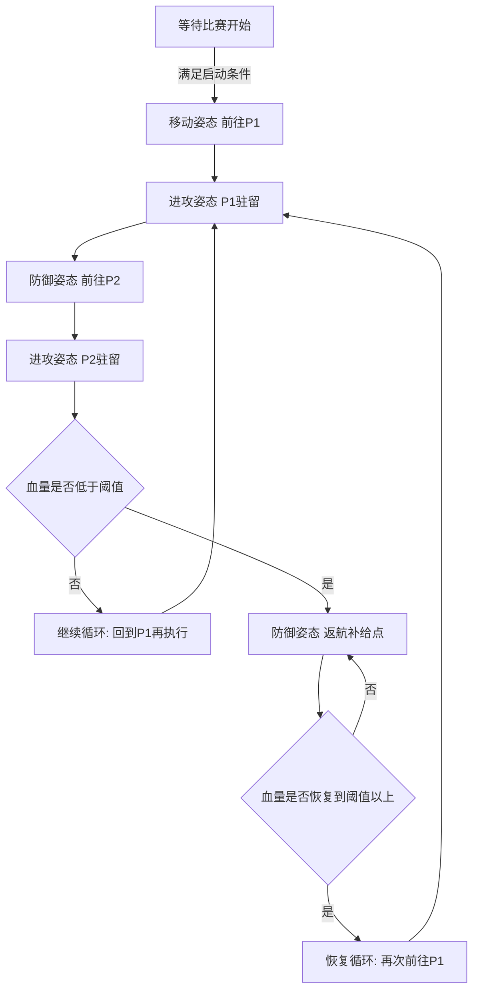
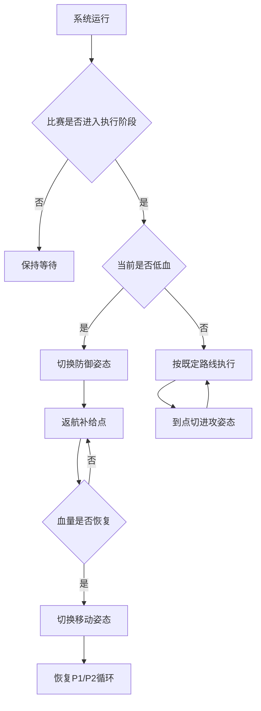

# 机器人姿态切换系统说明（图表版）

## 1. 展示目标
本说明用于直观展示哨兵机器人在实战场景中的三类姿态切换逻辑：
- 移动姿态（机动转点）
- 进攻姿态（到点驻留作战）
- 防御姿态（低血回撤补给）

目标是清晰说明“何时触发、如何决策、如何循环恢复”。

## 2. 姿态与触发条件总表
| 类型 | 触发条件 | 动作 | 结果 |
|---|---|---|---|
| 启动触发 | 比赛进入执行阶段 | 开始执行姿态流程 | 进入首轮路线 |
| 进攻触发 | 到达作战点（P1/P2） | 切换进攻姿态并驻留 | 展示定点进攻 |
| 低血触发 | 血量低于阈值 | 切换防御姿态并返航补给点 | 退出当前作战循环 |
| 恢复触发 | 补给后血量恢复至阈值以上 | 重新进入巡航作战循环 | 恢复常规展示 |

## 3. 姿态转化主流程图

## 4. 决策树（状态判断逻辑）

## 5. 时序说明（简表）
| 阶段 | 机器人位置 | 姿态 | 主要行为 |
|---|---|---|---|
| 阶段1 | 起始区 -> P1 | 移动 | 进入作战路线 |
| 阶段2 | P1 | 进攻 | 原地驻留展示 |
| 阶段3 | P1 -> P2 | 防御 | 低速防御机动 |
| 阶段4 | P2 | 进攻 | 原地驻留展示 |
| 阶段5 | 低血时 | 防御 | 返航补给点 |
| 阶段6 | 补给点 | 防御/等待 | 达到恢复条件后重启循环 |

## 6. 视频拍摄建议（对应图表讲解）
1. 全景机位：对照主流程图，拍全路径（补给点、P1、P2）。
2. 侧向机位：重点拍“到点切姿态”和“低血返航”。
3. 屏幕机位：同步显示触发条件变化与姿态切换结果。

讲解顺序建议：
1. 先讲“主流程图”
2. 再讲“决策树”
3. 最后结合实机画面讲“时序表”

## 7. 合规说明
演示过程中不使用遥控器等人为操控信号设备，机器人按预设触发条件自主完成姿态切换与决策执行。

---
该图表版文档可直接作为“姿态切换系统场景、触发条件、决策链路”的上传材料。
